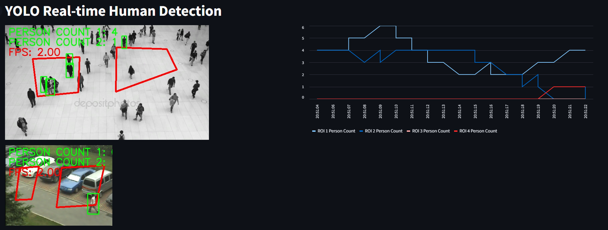

# YOLO-based Person Detection System

## Overview
This application uses the YOLOv8 object detection model to detect and count people in multiple regions of interest (ROIs) across multiple video streams. The system displays processed video streams in real-time alongside a chart that tracks person counts over time.

## Features
- Real-time person detection using YOLOv8
- Support for multiple video streams simultaneously
- Interactive ROI selection via mouse clicks
- Visualization of detection results with bounding boxes
- Real-time count of people in each ROI
- FPS monitoring
- Live chart displaying person count trends over time
- Processed video output saving

## Requirements
To run this application, you'll need the following packages:

```
ultralytics==8.0.0
opencv-python==4.8.0
streamlit==1.28.0
numpy==1.24.3
pandas==2.0.3
```

You can install these requirements using:

```bash
pip install -r requirements.txt
```

Or use the provided environment file:

```bash
conda env create -f environment.yml
```

## Setup and Installation

1. Clone the repository:
   ```bash
   git clone https://github.com/binhphan77373/Detection-Person-in-ROI.git
   cd Detection-Person-in-ROI
   ```

2. Install the required dependencies:
   ```bash
   pip install -r requirements.txt
   ```

3. Download the YOLOv8 model weights (the code uses yolov8n.pt by default)

## Usage

1. Update the video paths and output paths in the script to point to your video files:
   ```python
   video_paths = ["path/to/your/video1.mp4", "path/to/your/video2.mp4"]
   output_paths = ["path/to/output1.mp4", "path/to/output2.mp4"]
   ```

2. Run the application:
   ```bash
   streamlit run app.py
   ```

3. For each video, you will be prompted to select ROI points by clicking on the frame:
   - Click to define the corners of your ROI polygon (requires 4 points)
   - Each video will prompt you to define 2 ROIs
   - After selecting 4 points, a green outline will show the defined region
   - Press any key to continue to the next ROI selection

4. The application will process the videos in real-time showing:
   - The processed video streams with detection boxes
   - Person counts for each ROI
   - FPS information
   - A chart showing person count trends over time

5. Processed videos will be saved to the specified output paths.

## How It Works

### ROI Selection
The application allows you to define Regions of Interest (ROIs) by clicking points on the video frame. These points form a polygon, and only people detected within this polygon will be counted.

### Person Detection
The YOLOv8 model is used to detect people in each frame. The application checks if detected people are inside any of the defined ROIs and updates the count accordingly.

### Visualization
- Detected people are highlighted with green bounding boxes
- ROIs are outlined in blue
- Person counts for each ROI are displayed on the video frames
- A real-time chart shows the trend of person counts over time

## Customization

- To use a different YOLO model, change the model path:
  ```python
  model = YOLO("path/to/your/model.pt")
  ```

- To detect objects other than people, modify the classes parameter in the inference function:
  ```python
  results = model.predict(source=image, classes=[your_class_ids])
  ```

## Troubleshooting

- If OpenCV windows don't respond, try clicking on them to ensure they're in focus.
- If you encounter GPU memory issues, consider using a smaller YOLO model.
- If the FPS is too low, consider reducing the resolution of your input videos.
